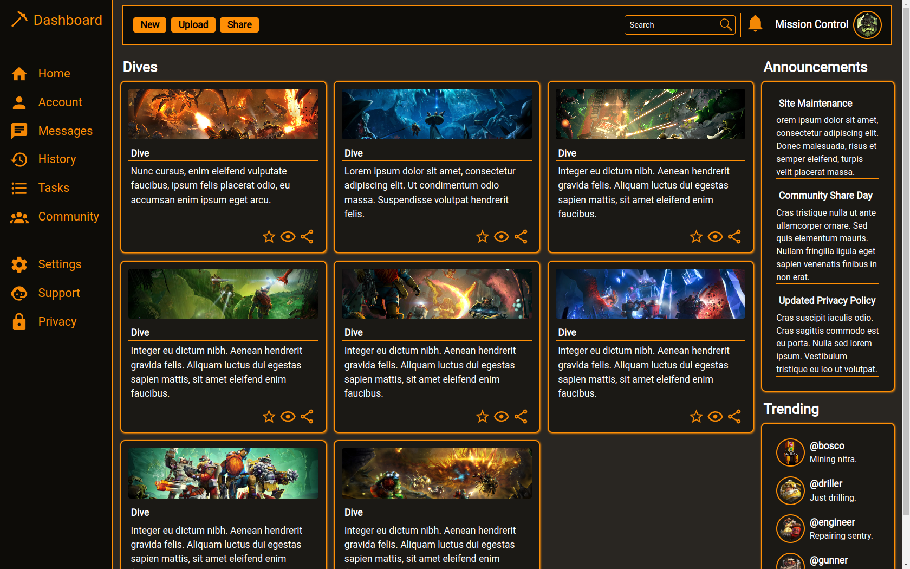

# Admin dashboard
An admin dashboard template made using grid display
Live demo [_here_](https://santyru-c.github.io/admin_dashboard/).

## General Information
The purpose of this project is to make use of all the concepts learnt in TOP grid lessons.
For that matter, the dashboard layout will be composed mostly of grids, although the use of flexbox will be considered for design.

## Technologies Used

The following tools and pages were used in the design process:
-[Adobe Color](https://color.adobe.com/create/image)
-[Tailwind](https://tailwindcss.com/docs/customizing-colors)
-[SVGs](https://pictogrammers.com/library/mdi/icon/pickaxe/)

## Screenshots

## Project Status
Project is: Finished

## Room for Improvement

Room for improvement:
- Although not necessary for the project. It would be nice to add some functionality to the page. 

To do:
- There is a block of commented code in the html file that contains a div with the class of charts. The main idea behind this was to learn about and nest charts inside the child divs of this section.
Because of a shortage of time this was not possible, but I would like to update this project in the future with this new section.

## Acknowledgements
- The main theme of the project was inspired by [this game](https://www.deeprockgalactic.com/).
- This project was based on [this tutorial](https://www.theodinproject.com/lessons/node-path-intermediate-html-and-css-admin-dashboard).

## Contact
Created by [Santyru-C](https://github.com/Santyru-C) - feel free to contact me!